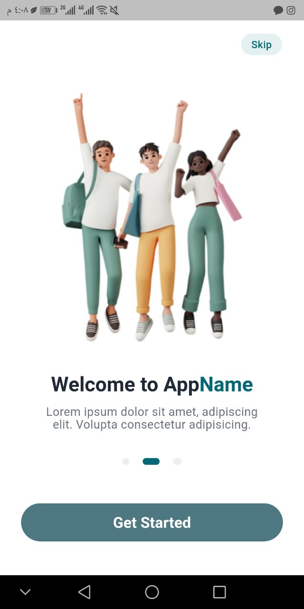
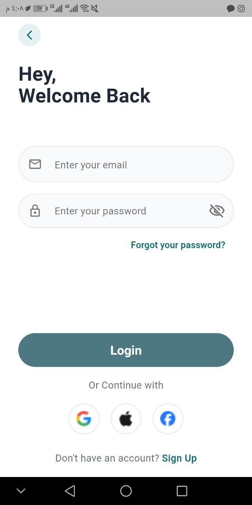
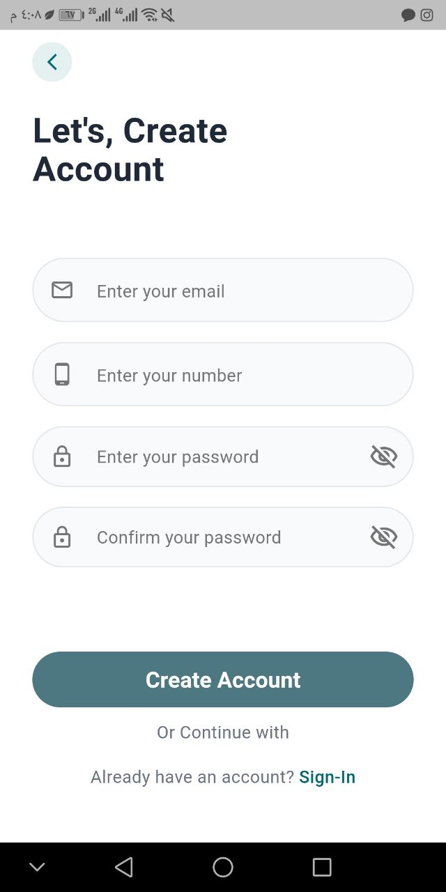

# Flutter Authentication System - Firebase Integrated 

A professional Flutter implementation featuring a secure authentication flow (Onboarding, Sign-In, and Sign-Up) with a focus on **Clean Architecture**, **Firebase Integration**, and **User Experience**.

---

## Key Features

 **Firebase Authentication:** Integrated with Firebase to handle real-time user registration and secure login.* **Robust Form Validation:** Implemented custom validation logic for:
     **Email:** Regex-based format checking.
     **Password:** Minimum length and "Confirm Password" matching logic.
     **Phone Number:** Length and digit verification.
 **Custom Spring Routing:** Physics-based transitions (`SpringPageRoute`) using `dart:physics` for a premium feel (Mass: 1, Stiffness: 45, Damping: 15).
 **Reusable Component Architecture:** Modular UI using custom-built widgets (`AppPrimaryButton`, `AppTextField`, `AppPasswordField`) for maximum maintainability.
 **Responsive UI:** Dynamic scaling using `MediaQuery` to ensure consistency across all device sizes.

---

## Tech Stack & Tools

 **Framework:** Flutter (Latest Version)
 **Backend:** Firebase Authentication
 **Language:** Dart
 **Design Tool:** Figma (Pixel-perfect implementation)
 **State Management:** StatefulWidget (Local state & UI logic)

---

## Screenshots

| Onboarding | Sign-In | Sign-Up |
| :---: | :---: | :---: |
|  |  |  |

---

## How to Run
Clone the repository:

Bash
git clone [https://github.com/Ayaezz1101/task.git](https://github.com/Ayaezz1101/task.git)
Firebase Setup:

Add your google-services.json (Android) or GoogleService-Info.plist (iOS) to the respective folders.

Install dependencies:

Bash
flutter pub get
Run the app:

Bash
flutter run

## Project Structure (Clean Code)

```text
lib/
├── pages/        # Authentication screens (SignIn, SignUp, Onboarding)
├── widgets/      # Reusable UI components (Buttons, Input Fields)
├── services/     # Firebase Authentication & Google Sign-In logic (AuthService)
├── theme/        # Centralized styles and color palettes
└── routing/      # Custom navigation and animation logic
